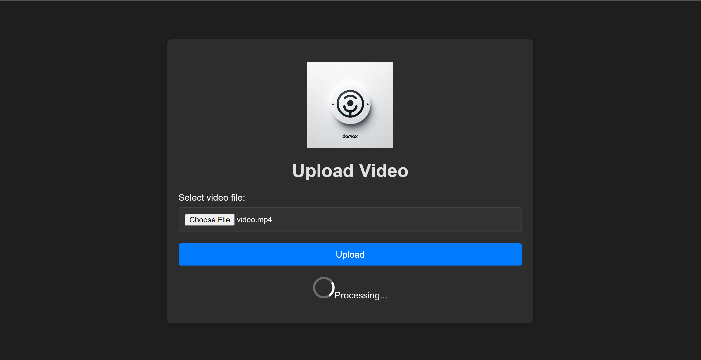
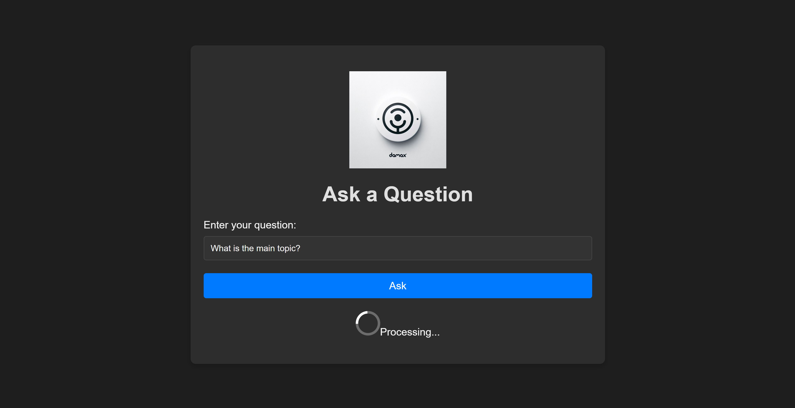
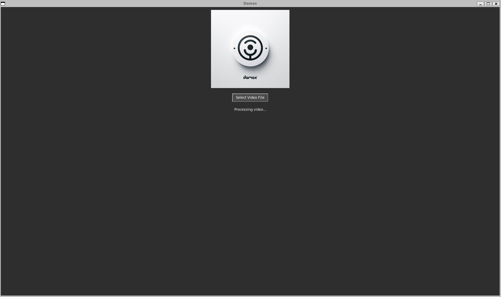
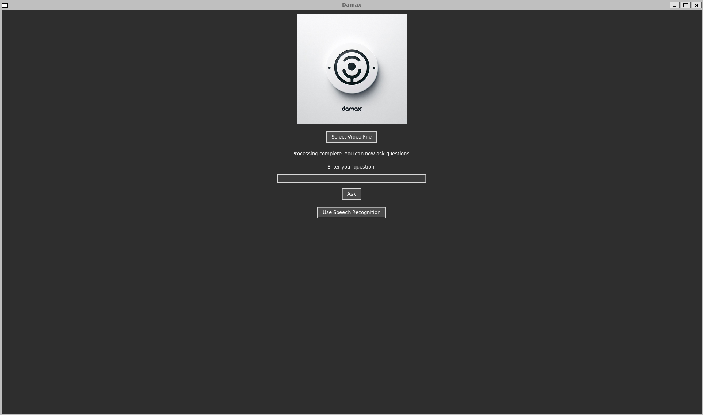
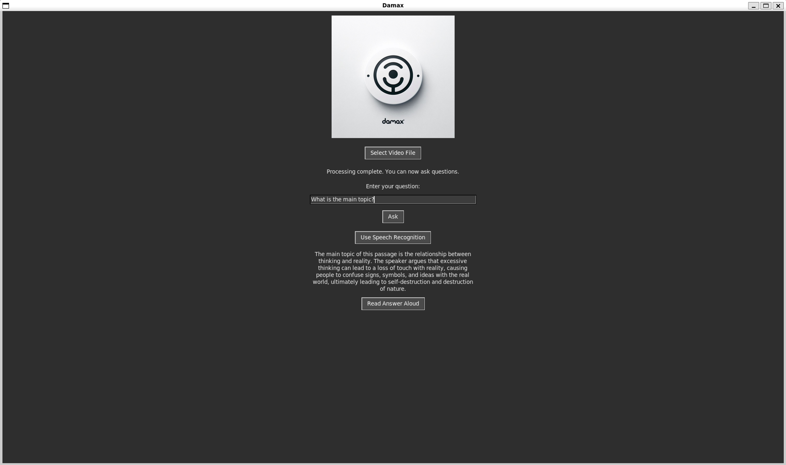
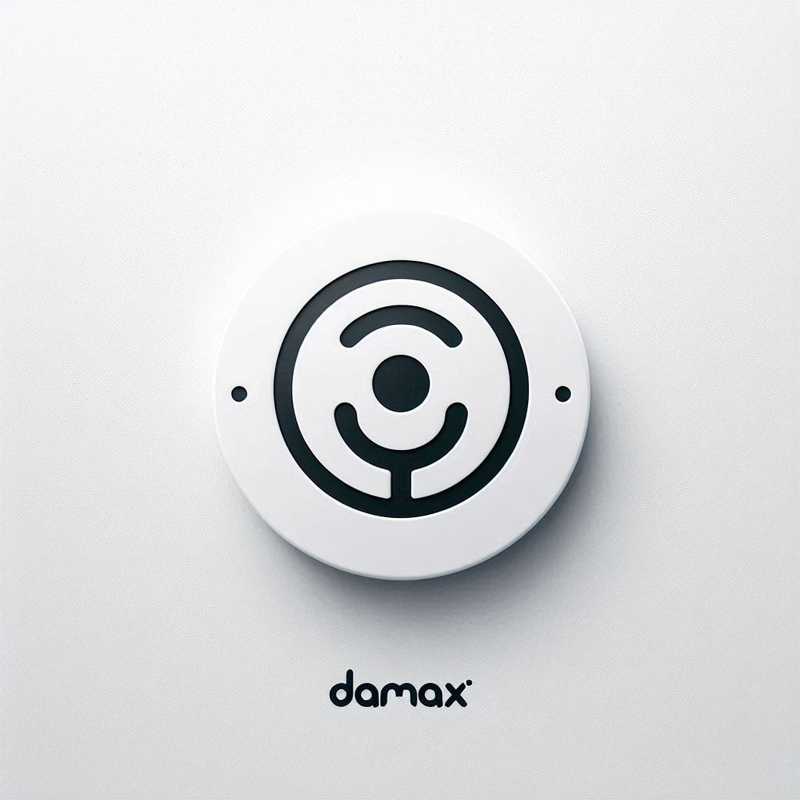

# Damax 🚀
## Local LLM to chat with your videos and Audios
Ever feel overwhelmed by the endless hours of podcasts, audiobooks, or videos, such as meeting recordings or tutorials? Imagine a podcast that’s 2 hours long or an audiobook that stretches to 40 hours! Do you really need to listen to every single word? Or spend 20 minutes on a product review video just to know if it’s good or bad?

Not anymore! With Damax, you can focus on what truly matters. Get straight to the core information that adds value to your knowledge.

Damax lets you chat or talk with your video or audio, ask anything about it, get summaries, and more. Plus, you can compress audio to a shorter version, making it faster and easier to consume.

Save time, stay informed, and enjoy the essentials with Damax! 🚀

## Features

1- Discover the Ultimate Chatting with your media! 🚀

2- Seamlessly Handles Audio & Video 🎧🎥

3- Works Locally & Offline 🌐🚫

4- Simple GUI for Windows & Linux 💻

5- Minimalist Web UI with a Stunning Dark Theme 🌙🖥️

6- Interact with Text or Voice 🗣️⌨️

7- Get Answers Read Aloud 🔊📢

8- Human-Like Voice Responses Generation (Up to 13 Seconds) 🗣️💬

## Web UI

## GUI

## LOGO

